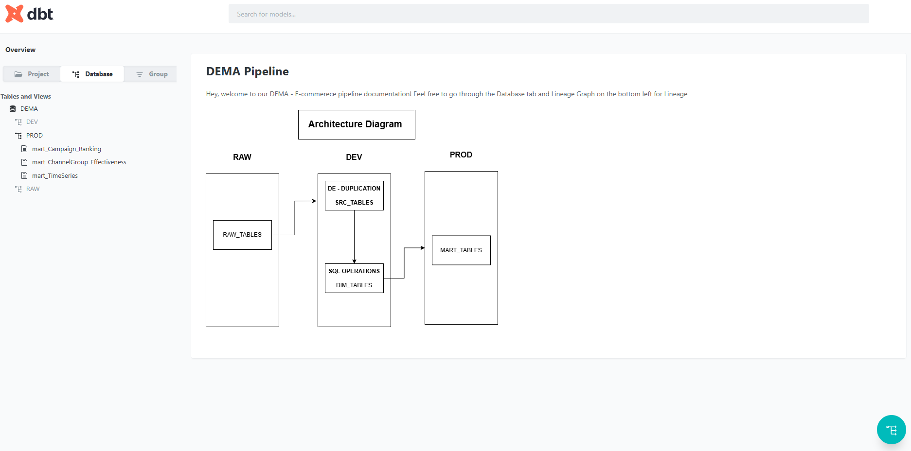

Welcome to your Dema-Ecommerece dbt project!

## Description 
    This Project Consists of Setting up of DBT and Database Architecture Using Snowflake Storage and Compute.

### Objective 
    To Answer Business questions such as - How Effective Channels are ? , How is the campaign Monetary Performance ? How are the sales overall.
### Setting UP
    1. Create Dema Folder 
    2. Create a virtual Environment - Python==3.12.3
    3. Install and dbt-snowflake==1.7.1, 
    4. Setting Up DBT 
       - Create \.dbt inside the user folder to store profiles.yml - `mkdir %userprofile%\.dbt`
       - Initiate dbt - `dbt init demadbt`
       - Connect Snowflake(Account Already setup) - Credentials Will be shared in  mail(if required)
       - Check the connection - `dbt debug`
       - Install dbt Packages in packeges.yml - `dbt deps`
    Now We are ready !!

### Running
    1. Run `dbt docs serve` - to open the documentation (You Can find Lineage and Architecture Diagram).
    
    
    
    2. You can make Changes to the sql statements And  run - `dbt run`.
#### Testing
    1. `dbt run` will initiate the tests Or you can use `dbt test` to test the sql explicitly.
    2.  Total of six tests  4 inbuilt  2 custom tests have been used to validate the data. You can find the detailed list under `schema.yml`

##### PS
    If I had some more time I would have orchestrated this pipeline with Dagster.

